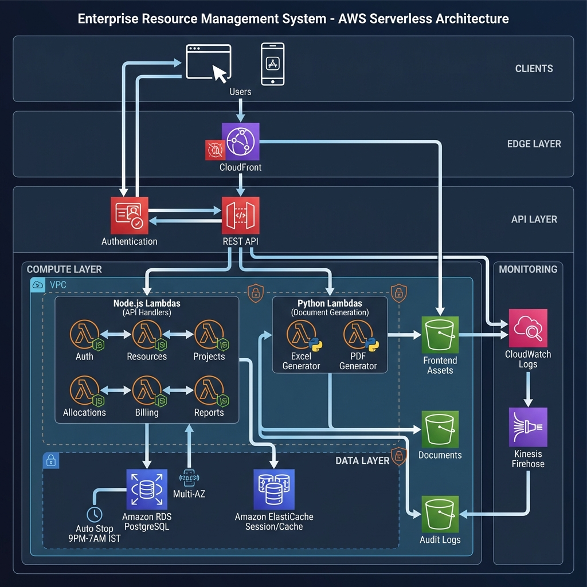
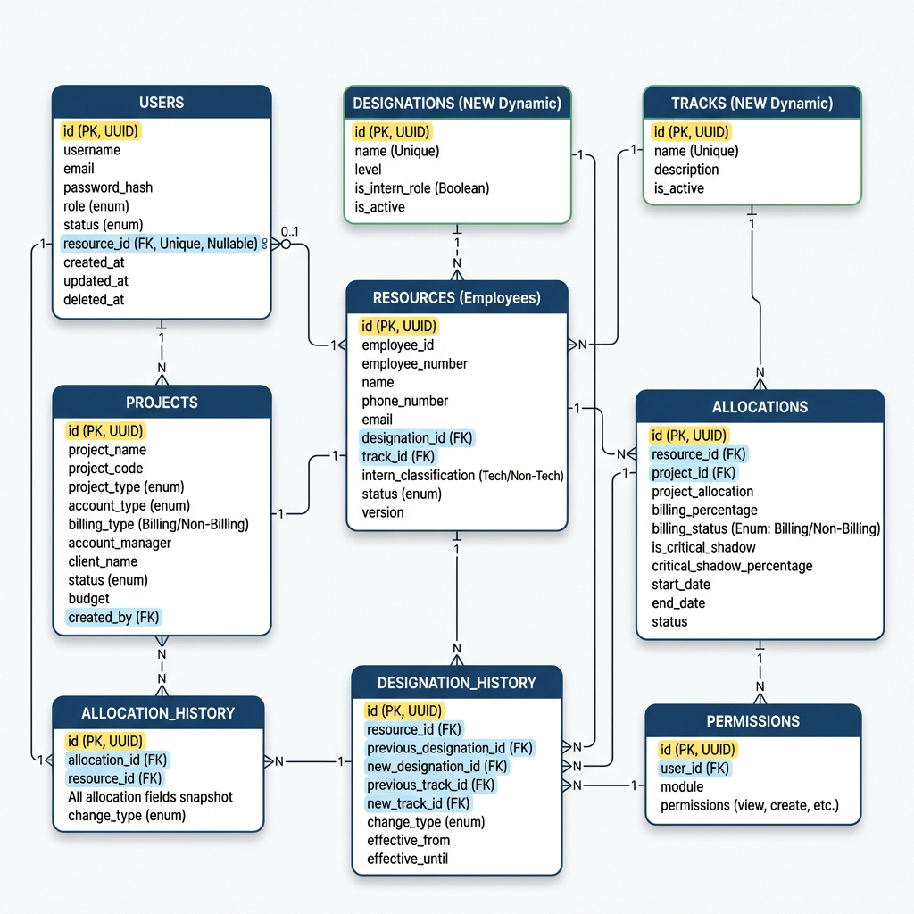

# Backend Architecture Document
## 1BT Resource Management System - AWS Serverless Architecture

**Version:** 1.0  
**Date:** January 2026  
**Author:** Technical Architecture Team  
**Status:** Draft

---

## 1. Executive Summary

This document outlines a production-grade, serverless backend architecture for the 1BT Resource Management System using AWS services. The architecture leverages **Node.js** for API services and **Python** for document generation, with comprehensive audit trail capabilities and cost-optimized RDS scheduling.

### 1.1 Architecture Principles
- **Serverless-First**: Minimize operational overhead with managed services
- **Cost-Optimized**: RDS shutdown during non-business hours (9PM - 7AM IST)
- **Security-Centric**: Full audit trail, encryption at rest/transit, RBAC
- **Scalable**: Auto-scaling for variable workloads
- **Highly Available**: Multi-AZ deployments for critical components

---

## 2. High-Level Architecture

```
┌─────────────────────────────────────────────────────────────────────────────────┐
│                              INTERNET / CLIENTS                                   │
└─────────────────────────────────────────────────────────────────────────────────┘
                                        │
                                        ▼
┌─────────────────────────────────────────────────────────────────────────────────┐
│                            AWS CLOUDFRONT (CDN)                                   │
│                     Global Edge Caching + WAF Protection                          │
└─────────────────────────────────────────────────────────────────────────────────┘
                                        │
                    ┌───────────────────┴───────────────────┐
                    ▼                                       ▼
    ┌───────────────────────────┐           ┌───────────────────────────┐
    │      S3 (Frontend)        │           │      API Gateway          │
    │   React Static Assets     │           │    REST API Endpoints     │
    └───────────────────────────┘           └───────────────────────────┘
                                                        │
                    ┌───────────────────────────────────┼───────────────────────────────────┐
                    │                                   │                                   │
                    ▼                                   ▼                                   ▼
    ┌───────────────────────────┐   ┌───────────────────────────┐   ┌───────────────────────────┐
    │   Lambda (Node.js)        │   │   Lambda (Node.js)        │   │   Lambda (Python)         │
    │   API Handlers            │   │   Auth/Authorization      │   │   Document Generation     │
    └───────────────────────────┘   └───────────────────────────┘   └───────────────────────────┘
                    │                           │                               │
                    └───────────────────────────┴───────────────────────────────┘
                                                │
                    ┌───────────────────────────┼───────────────────────────────────┐
                    ▼                           ▼                                   ▼
    ┌───────────────────────────┐   ┌───────────────────────────┐   ┌───────────────────────────┐
    │   RDS PostgreSQL          │   │   S3 (Documents)          │   │   ElastiCache Redis       │
    │   Multi-AZ                │   │   Generated Reports       │   │   Session/Cache           │
    │   Auto Stop: 9PM-7AM IST  │   └───────────────────────────┘   └───────────────────────────┘
    └───────────────────────────┘
                    │
                    ▼
    ┌───────────────────────────┐
    │   CloudWatch + S3         │
    │   Audit Trail Storage     │
    └───────────────────────────┘
```

### 2.1 Architecture Diagram



---

## 3. AWS Services Architecture

### 3.1 API Layer

#### Amazon API Gateway
| Configuration | Value |
|---------------|-------|
| Type | REST API |
| Authorization | AWS Cognito + Lambda Authorizer |
| Throttling | 10,000 requests/second |
| Stage | dev, staging, production |
| API Key | Required for external integrations |

**API Structure:**
```
/api/v1
├── /auth
│   ├── POST /login
│   ├── POST /logout
│   ├── POST /refresh-token
│   └── POST /forgot-password
├── /resources
│   ├── GET    /                    # List resources
│   ├── POST   /                    # Create resource
│   ├── GET    /{id}                # Get resource
│   ├── PUT    /{id}                # Update resource
│   ├── DELETE /{id}                # Soft delete resource
│   ├── GET    /{id}/allocations    # Get resource allocations
│   └── GET    /{id}/designation-history  # Get designation/career history
├── /designations
│   ├── GET    /                    # List designations
│   ├── POST   /                    # Create designation
│   ├── GET    /{id}                # Get designation
│   ├── PUT    /{id}                # Update designation
│   └── DELETE /{id}                # Soft delete designation
├── /tracks
│   ├── GET    /                    # List tracks
│   ├── POST   /                    # Create track
│   ├── GET    /{id}                # Get track
│   ├── PUT    /{id}                # Update track
│   └── DELETE /{id}                # Soft delete track
├── /clients
│   ├── GET    /                    # List clients
│   ├── POST   /                    # Create client
│   ├── GET    /{id}                # Get client
│   ├── PUT    /{id}                # Update client
│   └── DELETE /{id}                # Soft delete client
├── /projects
│   ├── GET    /                    # List projects
│   ├── POST   /                    # Create project
│   ├── GET    /{id}                # Get project
│   ├── PUT    /{id}                # Update project
│   ├── DELETE /{id}                # Soft delete project
│   └── GET    /{id}/allocations    # Get project allocations
├── /allocations
│   ├── GET    /                    # List allocations
│   ├── POST   /                    # Create allocation
│   ├── GET    /{id}                # Get allocation
│   ├── PUT    /{id}                # Update allocation
│   ├── DELETE /{id}                # Remove allocation
│   └── GET    /history/resource/{resourceId}  # Get allocation history for employee
├── /billing
│   ├── GET    /projects/{id}       # Get project billing
│   ├── POST   /calculate           # Calculate billing
│   └── GET    /reports             # Get billing reports
├── /users
│   ├── GET    /                    # List users
│   ├── POST   /                    # Create user
│   ├── GET    /{id}                # Get user
│   ├── PUT    /{id}                # Update user
│   ├── PUT    /{id}/permissions    # Update permissions
│   └── DELETE /{id}                # Deactivate user
├── /reports
│   ├── GET    /summary             # Summary dashboard
│   ├── GET    /account-manager     # Account manager report
│   ├── GET    /bench               # Bench report
│   ├── GET    /non-billing         # Non-billing report
│   ├── GET    /tier-breakdown      # Tier breakdown
│   ├── GET    /intern              # Intern report
│   ├── GET    /training            # Training report
│   ├── GET    /external-consultants# External consultants
│   ├── GET    /allocation-history  # Allocation history
│   └── GET    /master-sheet        # Master sheet (all tracks)
├── /documents
│   ├── POST   /export/excel        # Export to Excel
│   ├── POST   /export/pdf          # Export to PDF
│   └── GET    /{id}/download       # Download document
└── /audit
    ├── GET    /logs                # Query audit logs
    └── GET    /logs/{entityType}/{id} # Entity audit history
```

---

### 3.2 Compute Layer - AWS Lambda

#### Node.js Lambda Functions (API Handlers)

| Function Group | Runtime | Memory | Timeout | Description |
|----------------|---------|--------|---------|-------------|
| auth-handler | Node.js 20.x | 256MB | 30s | Authentication & session |
| resource-handler | Node.js 20.x | 512MB | 30s | Resource CRUD operations |
| project-handler | Node.js 20.x | 512MB | 30s | Project CRUD operations |
| allocation-handler | Node.js 20.x | 512MB | 30s | Allocation management |
| billing-handler | Node.js 20.x | 1024MB | 60s | Billing calculations |
| user-handler | Node.js 20.x | 256MB | 30s | User & permission management |
| report-handler | Node.js 20.x | 1024MB | 60s | Dashboard & report APIs |
| audit-handler | Node.js 20.x | 256MB | 30s | Audit log queries |

#### Python Lambda Functions (Document Generation)

| Function | Runtime | Memory | Timeout | Description |
|----------|---------|--------|---------|-------------|
| excel-generator | Python 3.12 | 1024MB | 120s | Excel report generation |
| pdf-generator | Python 3.12 | 1024MB | 120s | PDF report generation |
| scheduled-reports | Python 3.12 | 1024MB | 300s | Automated report generation |

**Lambda Layers:**
- `nodejs-common` - Shared utilities, database clients, validation
- `python-reporting` - openpyxl, reportlab, pandas

---

### 3.3 Database Layer

#### Amazon RDS PostgreSQL

| Configuration | Value |
|---------------|-------|
| Engine | PostgreSQL 15.x |
| Instance Class | db.t3.medium (Production) |
| Storage | 100GB gp3, Auto-scaling |
| Multi-AZ | Yes (Production) |
| Encryption | AES-256 at rest |
| Backup Retention | 7 days |

**Cost Optimization - RDS Auto Stop/Start Schedule:**

```
┌─────────────────────────────────────────────────────────────────┐
│                    RDS Availability Schedule                     │
│                     (Timezone: GMT+5:30 IST)                     │
├─────────────────────────────────────────────────────────────────┤
│  7:00 AM ────────────────── RDS RUNNING ────────────── 9:00 PM  │
│                                                                  │
│  9:00 PM ────────────────── RDS STOPPED ────────────── 7:00 AM  │
└─────────────────────────────────────────────────────────────────┘
```

**Implementation via AWS EventBridge + Lambda:**

```javascript
// EventBridge Rule: Stop RDS at 9PM IST (3:30 PM UTC)
{
  "ScheduleExpression": "cron(30 15 * * ? *)",
  "Target": "rds-scheduler-lambda",
  "Input": { "action": "stop" }
}

// EventBridge Rule: Start RDS at 7AM IST (1:30 AM UTC)
{
  "ScheduleExpression": "cron(30 1 * * ? *)",
  "Target": "rds-scheduler-lambda",
  "Input": { "action": "start" }
}
```

**RDS Scheduler Lambda (Node.js):**
```javascript
const { RDSClient, StopDBInstanceCommand, StartDBInstanceCommand } = require('@aws-sdk/client-rds');

exports.handler = async (event) => {
  const rds = new RDSClient({ region: process.env.AWS_REGION });
  const dbInstanceId = process.env.RDS_INSTANCE_ID;
  
  const command = event.action === 'stop' 
    ? new StopDBInstanceCommand({ DBInstanceIdentifier: dbInstanceId })
    : new StartDBInstanceCommand({ DBInstanceIdentifier: dbInstanceId });
  
  await rds.send(command);
  
  // Log to audit trail
  await logAuditEvent({
    action: `RDS_${event.action.toUpperCase()}`,
    entityType: 'SYSTEM',
    entityId: dbInstanceId,
    timestamp: new Date().toISOString()
  });
};
```

#### Database Schema (Industry Best Practices)

##### Entity-Relationship Diagram



> **Design Principles Applied:**
> - Soft delete pattern (no hard deletes for audit compliance)
> - Version tracking for critical entities
> - Comprehensive constraints and validations
> - Proper naming conventions (snake_case)
> - UUID primary keys for security
> - Timestamp tracking on all tables
> - Row-level security preparation

```sql
-- =====================================================
-- EXTENSIONS & CONFIGURATION
-- =====================================================
CREATE EXTENSION IF NOT EXISTS "uuid-ossp";      -- UUID generation
CREATE EXTENSION IF NOT EXISTS "pgcrypto";       -- Cryptographic functions

-- =====================================================
-- CUSTOM ENUM TYPES (Type Safety)
-- =====================================================
CREATE TYPE user_role AS ENUM ('Super User', 'Admin', 'User');
CREATE TYPE user_status AS ENUM ('Active', 'Inactive', 'Suspended', 'Pending');
CREATE TYPE resource_status AS ENUM ('Active', 'Inactive', 'Serving Notice Period', 'On Leave');
CREATE TYPE project_status AS ENUM ('Active', 'Inactive', 'Completed', 'On Hold');
CREATE TYPE project_type AS ENUM ('Client', 'Bench', 'Training', 'POC', 'Presale', 'Research');
CREATE TYPE account_type AS ENUM ('Internal', 'External');
-- Simplified per user request: only 'Billing' or 'Non-Billing'. Rest are project types.
CREATE TYPE billing_status AS ENUM ('Billing', 'Non-Billing');
CREATE TYPE change_type AS ENUM ('CREATED', 'UPDATED', 'DELETED', 'RESTORED');

-- =====================================================
-- BASE AUDIT COLUMNS FUNCTION
-- =====================================================
-- Automatically updates updated_at on any row modification
CREATE OR REPLACE FUNCTION update_updated_at_column()
RETURNS TRIGGER AS $$
BEGIN
    NEW.updated_at = CURRENT_TIMESTAMP;
    RETURN NEW;
END;
$$ LANGUAGE plpgsql;

-- =====================================================
-- USERS TABLE (Authentication & Authorization)
-- =====================================================
CREATE TABLE users (
    -- Primary Key
    id UUID PRIMARY KEY DEFAULT gen_random_uuid(),
    
    -- Authentication Fields
    username VARCHAR(50) NOT NULL,
    email VARCHAR(100) NOT NULL,
    password_hash VARCHAR(255) NOT NULL,
    
    -- Authorization Fields
    role user_role NOT NULL DEFAULT 'User',
    resource_id UUID UNIQUE REFERENCES resources(id) ON DELETE SET NULL,  -- Link to Employee profile
    
    -- Security Fields
    failed_login_attempts INTEGER DEFAULT 0 CHECK (failed_login_attempts >= 0),
    locked_until TIMESTAMP WITH TIME ZONE,
    last_login TIMESTAMP WITH TIME ZONE,
    password_changed_at TIMESTAMP WITH TIME ZONE DEFAULT CURRENT_TIMESTAMP,
    must_change_password BOOLEAN DEFAULT FALSE,
    
    -- Soft Delete & Status
    status user_status NOT NULL DEFAULT 'Pending',
    deleted_at TIMESTAMP WITH TIME ZONE,
    
    -- Audit Columns
    created_at TIMESTAMP WITH TIME ZONE DEFAULT CURRENT_TIMESTAMP NOT NULL,
    updated_at TIMESTAMP WITH TIME ZONE DEFAULT CURRENT_TIMESTAMP NOT NULL,
    created_by UUID REFERENCES users(id),
    
    -- Constraints
    CONSTRAINT users_username_unique UNIQUE (username) WHERE deleted_at IS NULL,
    CONSTRAINT users_email_unique UNIQUE (email) WHERE deleted_at IS NULL,
    CONSTRAINT users_email_format CHECK (email ~* '^[A-Za-z0-9._%+-]+@[A-Za-z0-9.-]+\.[A-Za-z]{2,}$'),
    CONSTRAINT users_username_format CHECK (username ~* '^[a-zA-Z0-9_]{3,50}$')
);

CREATE TRIGGER users_updated_at 
    BEFORE UPDATE ON users 
    FOR EACH ROW EXECUTE FUNCTION update_updated_at_column();

-- =====================================================
-- TRACKS TABLE (Dynamic)
-- =====================================================
CREATE TABLE tracks (
    id UUID PRIMARY KEY DEFAULT gen_random_uuid(),
    name VARCHAR(50) NOT NULL UNIQUE,  -- e.g., 'FS', '.Net', 'DS', 'QA'
    description TEXT,
    is_active BOOLEAN DEFAULT TRUE,
    created_at TIMESTAMP WITH TIME ZONE DEFAULT CURRENT_TIMESTAMP,
    updated_at TIMESTAMP WITH TIME ZONE DEFAULT CURRENT_TIMESTAMP,
    created_by UUID REFERENCES users(id)
);

-- =====================================================
-- DESIGNATIONS TABLE (Dynamic)
-- =====================================================
CREATE TABLE designations (
    id UUID PRIMARY KEY DEFAULT gen_random_uuid(),
    name VARCHAR(50) NOT NULL UNIQUE,  -- e.g., 'Senior Software Engineer', 'Intern - SE'
    level INTEGER,                     -- Optional hierarchy level
    is_intern_role BOOLEAN DEFAULT FALSE, -- Flag to identify intern roles
    is_active BOOLEAN DEFAULT TRUE,
    created_at TIMESTAMP WITH TIME ZONE DEFAULT CURRENT_TIMESTAMP,
    updated_at TIMESTAMP WITH TIME ZONE DEFAULT CURRENT_TIMESTAMP,
    created_by UUID REFERENCES users(id)
);

-- =====================================================
-- RESOURCES TABLE (Employees)
-- =====================================================
CREATE TABLE resources (
    -- Primary Key
    id UUID PRIMARY KEY DEFAULT gen_random_uuid(),
    
    -- Identity Fields
    employee_id VARCHAR(20) NOT NULL,
    employee_number VARCHAR(20) NOT NULL,
    name VARCHAR(100) NOT NULL,
    
    -- Contact Information (Encrypted at application level)
    phone_number VARCHAR(100) NOT NULL,  -- Encrypted
    email VARCHAR(100),
    address VARCHAR(500),
    
    -- Role Information (Linked to dynamic tables)
    designation_id UUID NOT NULL REFERENCES designations(id),
    track_id UUID NOT NULL REFERENCES tracks(id),
    
    -- Intern Classification (Only for Dev track interns: Tech or Non-Tech)
    intern_classification VARCHAR(20) CHECK (
        intern_classification IN ('Tech', 'Non-Tech') OR intern_classification IS NULL
    ),
    
    -- Skills & Experience
    skills TEXT[] DEFAULT '{}',
    date_of_joining DATE,
    
    -- Employment Status
    status resource_status NOT NULL DEFAULT 'Active',
    notice_period_end_date DATE,
    
    -- Soft Delete
    deleted_at TIMESTAMP WITH TIME ZONE,
    
    -- Version Tracking (for optimistic locking)
    version INTEGER DEFAULT 1 NOT NULL,
    
    -- Audit Columns
    created_at TIMESTAMP WITH TIME ZONE DEFAULT CURRENT_TIMESTAMP NOT NULL,
    updated_at TIMESTAMP WITH TIME ZONE DEFAULT CURRENT_TIMESTAMP NOT NULL,
    created_by UUID REFERENCES users(id) NOT NULL,
    updated_by UUID REFERENCES users(id),
    
    -- Constraints
    CONSTRAINT resources_employee_id_unique UNIQUE (employee_id) WHERE deleted_at IS NULL,
    CONSTRAINT resources_employee_number_unique UNIQUE (employee_number) WHERE deleted_at IS NULL,
    CONSTRAINT resources_name_length CHECK (length(name) >= 2),
    CONSTRAINT resources_notice_period_valid CHECK (
        (status = 'Serving Notice Period' AND notice_period_end_date IS NOT NULL) OR
        (status != 'Serving Notice Period')
    )
);

CREATE TRIGGER resources_updated_at 
    BEFORE UPDATE ON resources 
    FOR EACH ROW EXECUTE FUNCTION update_updated_at_column();

-- =====================================================
-- CLIENTS TABLE
-- =====================================================
CREATE TABLE clients (
    id UUID PRIMARY KEY DEFAULT gen_random_uuid(),
    client_name VARCHAR(100) NOT NULL UNIQUE,
    client_code VARCHAR(20) UNIQUE,     -- Short code e.g., 'MSFT'
    contact_person VARCHAR(100),
    contact_email VARCHAR(100),
    contact_phone VARCHAR(50),
    address VARCHAR(500),
    billing_address VARCHAR(500),       -- Specifically for invoicing
    currency VARCHAR(3) DEFAULT 'USD',
    status VARCHAR(20) DEFAULT 'Active',
    created_at TIMESTAMP WITH TIME ZONE DEFAULT CURRENT_TIMESTAMP,
    updated_at TIMESTAMP WITH TIME ZONE DEFAULT CURRENT_TIMESTAMP,
    created_by UUID REFERENCES users(id)
);

-- =====================================================
-- PROJECTS TABLE
-- =====================================================
CREATE TABLE projects (
    -- Primary Key
    id UUID PRIMARY KEY DEFAULT gen_random_uuid(),
    
    -- Project Identity
    project_name VARCHAR(200) NOT NULL,
    project_code VARCHAR(50),  -- External project identifier
    
    -- Classification
    project_type project_type NOT NULL,
    account_type account_type NOT NULL,
    
    -- Team Information
    team_size INTEGER NOT NULL DEFAULT 1 CHECK (team_size >= 1),
    account_manager VARCHAR(100) NOT NULL,
    account_reg_sales_owner VARCHAR(100),
    
    -- Client Information (Linked)
    client_id UUID REFERENCES clients(id),  -- Required if account_type = External
    
    -- Timeline
    project_start_date DATE,
    project_end_date DATE,
    
    -- Billing & Budget
    billing_type VARCHAR(20) DEFAULT 'Billing' CHECK (billing_type IN ('Billing', 'Non-Billing')),
    budget DECIMAL(15,2) CHECK (budget >= 0),
    
    -- Status & Description
    status project_status NOT NULL DEFAULT 'Active',
    description TEXT,
    
    -- Soft Delete
    deleted_at TIMESTAMP WITH TIME ZONE,
    
    -- Version Tracking
    version INTEGER DEFAULT 1 NOT NULL,
    
    -- Audit Columns
    created_at TIMESTAMP WITH TIME ZONE DEFAULT CURRENT_TIMESTAMP NOT NULL,
    updated_at TIMESTAMP WITH TIME ZONE DEFAULT CURRENT_TIMESTAMP NOT NULL,
    created_by UUID REFERENCES users(id) NOT NULL,
    updated_by UUID REFERENCES users(id),
    
    -- Constraints
    CONSTRAINT projects_name_unique UNIQUE (project_name) WHERE deleted_at IS NULL,
    CONSTRAINT projects_code_unique UNIQUE (project_code) WHERE deleted_at IS NULL AND project_code IS NOT NULL,
    CONSTRAINT projects_date_range CHECK (
        project_end_date IS NULL OR 
        project_start_date IS NULL OR 
        project_end_date >= project_start_date
    ),
    CONSTRAINT projects_client_required_for_external CHECK (
        (account_type = 'External' AND client_id IS NOT NULL) OR
        (account_type = 'Internal')
    ),
    CONSTRAINT projects_budget_disabled_for_non_billing CHECK (
        (billing_type = 'Non-Billing' AND budget IS NULL) OR
        (billing_type = 'Billing')
    )
);

CREATE TRIGGER projects_updated_at 
    BEFORE UPDATE ON projects 
    FOR EACH ROW EXECUTE FUNCTION update_updated_at_column();

-- =====================================================
-- ALLOCATIONS TABLE
-- =====================================================
CREATE TABLE allocations (
    -- Primary Key
    id UUID PRIMARY KEY DEFAULT gen_random_uuid(),
    
    -- Foreign Keys
    resource_id UUID NOT NULL REFERENCES resources(id) ON DELETE RESTRICT,
    project_id UUID NOT NULL REFERENCES projects(id) ON DELETE RESTRICT,
    
    -- Allocation Details
    project_allocation DECIMAL(5,2) NOT NULL,
    billing_percentage DECIMAL(5,2) NOT NULL,
    billing_status billing_status NOT NULL,
    
    -- Critical Shadow Tracking
    is_critical_shadow BOOLEAN DEFAULT FALSE NOT NULL,
    critical_shadow_percentage DECIMAL(5,2),
    
    -- Timeline
    start_date DATE NOT NULL DEFAULT CURRENT_DATE,
    end_date DATE,
    duration_days INTEGER GENERATED ALWAYS AS (
        CASE WHEN end_date IS NOT NULL 
        THEN end_date - start_date 
        ELSE NULL END
    ) STORED,
    
    -- Status
    status VARCHAR(20) NOT NULL DEFAULT 'Active' CHECK (status IN ('Active', 'Inactive')),
    notes TEXT,
    
    -- Soft Delete
    deleted_at TIMESTAMP WITH TIME ZONE,
    
    -- Version Tracking
    version INTEGER DEFAULT 1 NOT NULL,
    
    -- Audit Columns
    created_at TIMESTAMP WITH TIME ZONE DEFAULT CURRENT_TIMESTAMP NOT NULL,
    updated_at TIMESTAMP WITH TIME ZONE DEFAULT CURRENT_TIMESTAMP NOT NULL,
    created_by UUID REFERENCES users(id) NOT NULL,
    updated_by UUID REFERENCES users(id),
    
    -- Constraints
    CONSTRAINT allocations_resource_project_unique 
        UNIQUE (resource_id, project_id) WHERE deleted_at IS NULL AND status = 'Active',
    CONSTRAINT allocations_project_allocation_range 
        CHECK (project_allocation >= 0 AND project_allocation <= 200),
    CONSTRAINT allocations_billing_percentage_range 
        CHECK (billing_percentage >= 0 AND billing_percentage <= 100),
    CONSTRAINT allocations_date_range 
        CHECK (end_date IS NULL OR end_date >= start_date),
    CONSTRAINT allocations_critical_shadow_percentage 
        CHECK (
            (is_critical_shadow = TRUE AND critical_shadow_percentage IS NOT NULL AND 
             critical_shadow_percentage >= 0 AND critical_shadow_percentage <= 100) OR
            (is_critical_shadow = FALSE AND critical_shadow_percentage IS NULL)
        )
);

CREATE TRIGGER allocations_updated_at 
    BEFORE UPDATE ON allocations 
    FOR EACH ROW EXECUTE FUNCTION update_updated_at_column();

-- =====================================================
-- ALLOCATION HISTORY TABLE (Per Employee Tracking)
-- =====================================================
-- Records every allocation change for complete employee history
CREATE TABLE allocation_history (
    id UUID PRIMARY KEY DEFAULT gen_random_uuid(),
    allocation_id UUID REFERENCES allocations(id) ON DELETE SET NULL,
    resource_id UUID NOT NULL REFERENCES resources(id),
    project_id UUID NOT NULL REFERENCES projects(id),
    
    -- Snapshot of allocation state at time of change
    project_allocation DECIMAL(5,2) NOT NULL,
    billing_percentage DECIMAL(5,2) NOT NULL,
    billing_status VARCHAR(20) NOT NULL,
    is_critical_shadow BOOLEAN DEFAULT FALSE,
    critical_shadow_percentage DECIMAL(5,2),
    allocation_start_date DATE,
    allocation_end_date DATE,
    status VARCHAR(20),
    notes TEXT,
    
    -- History metadata
    change_type VARCHAR(20) NOT NULL, -- 'CREATED', 'UPDATED', 'DELETED'
    change_reason TEXT,               -- Optional reason for change
    previous_values JSONB,            -- Previous state before change (for UPDATED/DELETED)
    changed_fields TEXT[],            -- List of fields that changed (for UPDATED)
    
    -- Tracking info
    effective_date DATE NOT NULL DEFAULT CURRENT_DATE,
    changed_at TIMESTAMP DEFAULT CURRENT_TIMESTAMP,
    changed_by UUID REFERENCES users(id),
    changed_by_username VARCHAR(50),
    ip_address INET,
    user_agent TEXT
);

-- Indexes for efficient history queries
CREATE INDEX idx_allocation_history_resource ON allocation_history(resource_id);
CREATE INDEX idx_allocation_history_project ON allocation_history(project_id);
CREATE INDEX idx_allocation_history_allocation ON allocation_history(allocation_id);
CREATE INDEX idx_allocation_history_changed_at ON allocation_history(changed_at DESC);
CREATE INDEX idx_allocation_history_effective_date ON allocation_history(effective_date);
CREATE INDEX idx_allocation_history_resource_date ON allocation_history(resource_id, changed_at DESC);

-- =====================================================
-- DESIGNATION HISTORY TABLE (Career Progression Tracking)
-- =====================================================
-- Tracks all designation/role changes for each employee (promotions, transfers)
CREATE TABLE designation_history (
    id UUID PRIMARY KEY DEFAULT gen_random_uuid(),
    resource_id UUID NOT NULL REFERENCES resources(id) ON DELETE CASCADE,
    
    -- Designation Change Details
    previous_designation_id UUID REFERENCES designations(id),
    new_designation_id UUID NOT NULL REFERENCES designations(id),
    previous_track_id UUID REFERENCES tracks(id),
    new_track_id UUID NOT NULL REFERENCES tracks(id),
    
    -- Change Context
    change_type VARCHAR(30) NOT NULL CHECK (
        change_type IN ('INITIAL', 'PROMOTION', 'LATERAL_MOVE', 'TRACK_CHANGE', 'DEMOTION', 'CORRECTION')
    ),
    change_reason TEXT,                         -- Optional reason (e.g., "Performance review Q4 2025")
    
    -- Effective Period
    effective_from DATE NOT NULL DEFAULT CURRENT_DATE,
    effective_until DATE,                       -- NULL means current designation
    
    -- Audit Fields
    changed_at TIMESTAMP WITH TIME ZONE DEFAULT CURRENT_TIMESTAMP NOT NULL,
    changed_by UUID REFERENCES users(id),
    changed_by_username VARCHAR(50),
    
    -- Constraints
    CONSTRAINT designation_history_dates_valid CHECK (
        effective_until IS NULL OR effective_until >= effective_from
    )
);

-- Indexes for efficient queries
CREATE INDEX idx_designation_history_resource ON designation_history(resource_id);
CREATE INDEX idx_designation_history_resource_date ON designation_history(resource_id, effective_from DESC);
CREATE INDEX idx_designation_history_effective ON designation_history(effective_from, effective_until);

-- =====================================================
-- TRIGGER: Auto-capture designation changes
-- =====================================================
CREATE OR REPLACE FUNCTION capture_designation_history()
RETURNS TRIGGER AS $$
DECLARE
    v_change_type VARCHAR(30);
BEGIN
    -- Determine change type based on designation change
    IF TG_OP = 'INSERT' THEN
        v_change_type := 'INITIAL';
        
        INSERT INTO designation_history (
            resource_id, previous_designation_id, new_designation_id,
            previous_track_id, new_track_id, change_type, effective_from, changed_by
        ) VALUES (
            NEW.id, NULL, NEW.designation_id,
            NULL, NEW.track_id, v_change_type, COALESCE(NEW.date_of_joining, CURRENT_DATE), NEW.created_by
        );
        RETURN NEW;
        
    ELSIF TG_OP = 'UPDATE' THEN
        -- Only track if designation or track actually changed
        IF OLD.designation_id != NEW.designation_id OR OLD.track_id != NEW.track_id THEN
            -- Determine change type
            IF OLD.track_id != NEW.track_id THEN
                v_change_type := 'TRACK_CHANGE';
            ELSE
                -- Logic to detect promotion vs lateral move would require querying designation levels
                -- Defaulting to UPDATED/LATERAL_MOVE for now
                v_change_type := 'LATERAL_MOVE';
            END IF;
            
            -- Close out the previous designation period
            UPDATE designation_history
            SET effective_until = CURRENT_DATE - INTERVAL '1 day'
            WHERE resource_id = NEW.id 
              AND effective_until IS NULL;
            
            -- Insert new designation record
            INSERT INTO designation_history (
                resource_id, previous_designation_id, new_designation_id,
                previous_track_id, new_track_id, change_type, effective_from, changed_by
            ) VALUES (
                NEW.id, OLD.designation_id, NEW.designation_id,
                OLD.track_id, NEW.track_id, v_change_type, CURRENT_DATE, NEW.updated_by
            );
        END IF;
        RETURN NEW;
    END IF;
END;
$$ LANGUAGE plpgsql;

-- Attach trigger to resources table
CREATE TRIGGER trg_designation_history
    AFTER INSERT OR UPDATE ON resources
    FOR EACH ROW EXECUTE FUNCTION capture_designation_history();

-- Permissions Table
CREATE TABLE permissions (
    id UUID PRIMARY KEY DEFAULT gen_random_uuid(),
    user_id UUID NOT NULL REFERENCES users(id) ON DELETE CASCADE,
    module VARCHAR(50) NOT NULL,
    can_view BOOLEAN DEFAULT FALSE,
    can_create BOOLEAN DEFAULT FALSE,
    can_update BOOLEAN DEFAULT FALSE,
    can_delete BOOLEAN DEFAULT FALSE,
    created_at TIMESTAMP DEFAULT CURRENT_TIMESTAMP,
    updated_at TIMESTAMP DEFAULT CURRENT_TIMESTAMP,
    UNIQUE(user_id, module)
);

-- Audit Logs Table (for database-level audit)
CREATE TABLE audit_logs (
    id UUID PRIMARY KEY DEFAULT gen_random_uuid(),
    user_id UUID REFERENCES users(id),
    action VARCHAR(100) NOT NULL,
    entity_type VARCHAR(50) NOT NULL,
    entity_id UUID NOT NULL,
    old_value JSONB,
    new_value JSONB,
    ip_address INET,
    user_agent TEXT,
    timestamp TIMESTAMP DEFAULT CURRENT_TIMESTAMP
);

-- Indexes for performance
CREATE INDEX idx_resources_track ON resources(track);
CREATE INDEX idx_resources_status ON resources(status);
CREATE INDEX idx_resources_designation ON resources(designation);
CREATE INDEX idx_projects_status ON projects(status);
CREATE INDEX idx_projects_account_manager ON projects(account_manager);
CREATE INDEX idx_allocations_resource ON allocations(resource_id);
CREATE INDEX idx_allocations_project ON allocations(project_id);
CREATE INDEX idx_allocations_status ON allocations(status);
CREATE INDEX idx_audit_logs_entity ON audit_logs(entity_type, entity_id);
CREATE INDEX idx_audit_logs_timestamp ON audit_logs(timestamp);
CREATE INDEX idx_audit_logs_user ON audit_logs(user_id);

-- =====================================================
-- TRIGGER: Auto-capture allocation history on changes
-- =====================================================
CREATE OR REPLACE FUNCTION capture_allocation_history()
RETURNS TRIGGER AS $$
DECLARE
    v_changed_fields TEXT[] := '{}';
    v_previous_values JSONB := NULL;
BEGIN
    IF TG_OP = 'INSERT' THEN
        INSERT INTO allocation_history (
            allocation_id, resource_id, project_id,
            project_allocation, billing_percentage, billing_status,
            is_critical_shadow, critical_shadow_percentage,
            allocation_start_date, allocation_end_date, status, notes,
            change_type, effective_date, changed_by
        ) VALUES (
            NEW.id, NEW.resource_id, NEW.project_id,
            NEW.project_allocation, NEW.billing_percentage, NEW.billing_status,
            NEW.is_critical_shadow, NEW.critical_shadow_percentage,
            NEW.start_date, NEW.end_date, NEW.status, NEW.notes,
            'CREATED', CURRENT_DATE, NEW.created_by
        );
        RETURN NEW;
    
    ELSIF TG_OP = 'UPDATE' THEN
        -- Track which fields changed
        IF OLD.project_allocation != NEW.project_allocation THEN
            v_changed_fields := array_append(v_changed_fields, 'project_allocation');
        END IF;
        IF OLD.billing_percentage != NEW.billing_percentage THEN
            v_changed_fields := array_append(v_changed_fields, 'billing_percentage');
        END IF;
        IF OLD.billing_status != NEW.billing_status THEN
            v_changed_fields := array_append(v_changed_fields, 'billing_status');
        END IF;
        IF OLD.status != NEW.status THEN
            v_changed_fields := array_append(v_changed_fields, 'status');
        END IF;
        IF OLD.is_critical_shadow != NEW.is_critical_shadow THEN
            v_changed_fields := array_append(v_changed_fields, 'is_critical_shadow');
        END IF;
        
        -- Store previous values
        v_previous_values := jsonb_build_object(
            'project_allocation', OLD.project_allocation,
            'billing_percentage', OLD.billing_percentage,
            'billing_status', OLD.billing_status,
            'is_critical_shadow', OLD.is_critical_shadow,
            'critical_shadow_percentage', OLD.critical_shadow_percentage,
            'start_date', OLD.start_date,
            'end_date', OLD.end_date,
            'status', OLD.status,
            'notes', OLD.notes
        );
        
        INSERT INTO allocation_history (
            allocation_id, resource_id, project_id,
            project_allocation, billing_percentage, billing_status,
            is_critical_shadow, critical_shadow_percentage,
            allocation_start_date, allocation_end_date, status, notes,
            change_type, previous_values, changed_fields,
            effective_date, changed_by
        ) VALUES (
            NEW.id, NEW.resource_id, NEW.project_id,
            NEW.project_allocation, NEW.billing_percentage, NEW.billing_status,
            NEW.is_critical_shadow, NEW.critical_shadow_percentage,
            NEW.start_date, NEW.end_date, NEW.status, NEW.notes,
            'UPDATED', v_previous_values, v_changed_fields,
            CURRENT_DATE, NEW.updated_by
        );
        RETURN NEW;
    
    ELSIF TG_OP = 'DELETE' THEN
        v_previous_values := jsonb_build_object(
            'project_allocation', OLD.project_allocation,
            'billing_percentage', OLD.billing_percentage,
            'billing_status', OLD.billing_status,
            'is_critical_shadow', OLD.is_critical_shadow,
            'status', OLD.status
        );
        
        INSERT INTO allocation_history (
            allocation_id, resource_id, project_id,
            project_allocation, billing_percentage, billing_status,
            is_critical_shadow, critical_shadow_percentage,
            allocation_start_date, allocation_end_date, status, notes,
            change_type, previous_values, effective_date
        ) VALUES (
            OLD.id, OLD.resource_id, OLD.project_id,
            OLD.project_allocation, OLD.billing_percentage, OLD.billing_status,
            OLD.is_critical_shadow, OLD.critical_shadow_percentage,
            OLD.start_date, OLD.end_date, OLD.status, OLD.notes,
            'DELETED', v_previous_values, CURRENT_DATE
        );
        RETURN OLD;
    END IF;
END;
$$ LANGUAGE plpgsql;

-- Attach trigger to allocations table
CREATE TRIGGER trg_allocation_history
    AFTER INSERT OR UPDATE OR DELETE ON allocations
    FOR EACH ROW EXECUTE FUNCTION capture_allocation_history();
```

---

### 3.4 Caching Layer

#### Amazon ElastiCache (Redis)

| Configuration | Value |
|---------------|-------|
| Engine | Redis 7.x |
| Node Type | cache.t3.micro |
| Encryption | In-transit & at-rest |
| TTL Strategy | 5min for sessions, 1min for reports |

**Cache Strategy:**
```javascript
// Cache Keys Structure
const CACHE_KEYS = {
  SESSION: (userId) => `session:${userId}`,
  REPORT_SUMMARY: 'report:summary:v1',
  REPORT_TRACK: (track) => `report:track:${track}:v1`,
  USER_PERMISSIONS: (userId) => `permissions:${userId}`,
  PROJECT_LIST: 'projects:list:v1',
  RESOURCE_LIST: 'resources:list:v1'
};
```

---

### 3.5 Storage Layer

#### Amazon S3 Buckets

| Bucket | Purpose | Lifecycle |
|--------|---------|-----------|
| `1bt-rms-frontend-{env}` | React static assets | - |
| `1bt-rms-documents-{env}` | Generated reports (Excel/PDF) | 30-day expiry |
| `1bt-rms-audit-{env}` | Audit log archives | 2-year retention, then Glacier |
| `1bt-rms-backups-{env}` | Database backups | 90-day retention |

---

## 4. Audit Trail Architecture

### 4.1 Comprehensive Audit System

```
┌─────────────────────────────────────────────────────────────────────────────────┐
│                            AUDIT TRAIL ARCHITECTURE                              │
└─────────────────────────────────────────────────────────────────────────────────┘
                                        │
        ┌───────────────────────────────┼───────────────────────────────┐
        ▼                               ▼                               ▼
┌───────────────────┐       ┌───────────────────┐       ┌───────────────────┐
│  API Gateway      │       │  Lambda Functions │       │  RDS PostgreSQL   │
│  Access Logs      │       │  CloudWatch Logs  │       │  Audit Table      │
└───────────────────┘       └───────────────────┘       └───────────────────┘
        │                               │                               │
        └───────────────────────────────┼───────────────────────────────┘
                                        ▼
                        ┌───────────────────────────────┐
                        │     CloudWatch Logs           │
                        │     (Centralized Logging)     │
                        └───────────────────────────────┘
                                        │
                                        ▼
                        ┌───────────────────────────────┐
                        │   Kinesis Data Firehose       │
                        │   (Log Streaming)             │
                        └───────────────────────────────┘
                                        │
                                        ▼
                        ┌───────────────────────────────┐
                        │   S3 (Audit Archive)          │
                        │   2-Year Retention            │
                        │   → Glacier Deep Archive      │
                        └───────────────────────────────┘
```

### 4.2 Audit Event Types

| Category | Event Types |
|----------|-------------|
| **Authentication** | LOGIN, LOGOUT, LOGIN_FAILED, PASSWORD_CHANGE, SESSION_EXPIRED |
| **Resource** | RESOURCE_CREATE, RESOURCE_UPDATE, RESOURCE_DELETE, RESOURCE_VIEW |
| **Project** | PROJECT_CREATE, PROJECT_UPDATE, PROJECT_DELETE, PROJECT_VIEW |
| **Allocation** | ALLOCATION_CREATE, ALLOCATION_UPDATE, ALLOCATION_DELETE |
| **Billing** | BILLING_CALCULATE, BILLING_EXPORT |
| **User** | USER_CREATE, USER_UPDATE, USER_DEACTIVATE, PERMISSION_CHANGE |
| **System** | RDS_START, RDS_STOP, REPORT_GENERATE, EXPORT_DOCUMENT |

### 4.3 Audit Middleware (Node.js)

```javascript
// middleware/auditMiddleware.js
const { v4: uuidv4 } = require('uuid');
const { publishToKinesis } = require('../services/auditService');

const auditMiddleware = (actionType) => {
  return async (req, res, next) => {
    const startTime = Date.now();
    const auditId = uuidv4();
    
    // Capture original response
    const originalJson = res.json.bind(res);
    res.json = async (data) => {
      const auditEvent = {
        id: auditId,
        timestamp: new Date().toISOString(),
        userId: req.user?.id || 'anonymous',
        username: req.user?.username || 'anonymous',
        action: actionType,
        entityType: req.baseUrl.split('/').pop(),
        entityId: req.params.id || data?.id || null,
        method: req.method,
        path: req.originalUrl,
        ipAddress: req.ip || req.headers['x-forwarded-for'],
        userAgent: req.headers['user-agent'],
        requestBody: sanitizeRequestBody(req.body),
        responseStatus: res.statusCode,
        duration: Date.now() - startTime
      };
      
      // Async publish to Kinesis (non-blocking)
      publishToKinesis(auditEvent).catch(console.error);
      
      // Also write to RDS for immediate queries
      if (shouldPersistToDatabase(actionType)) {
        await writeToAuditTable(auditEvent);
      }
      
      return originalJson(data);
    };
    
    next();
  };
};

const sanitizeRequestBody = (body) => {
  const sanitized = { ...body };
  delete sanitized.password;
  delete sanitized.confirmPassword;
  return sanitized;
};

module.exports = { auditMiddleware };
```

### 4.4 Audit Retention Policy

| Period | Storage | Cost Tier |
|--------|---------|-----------|
| 0-30 days | RDS + CloudWatch | Hot |
| 30-365 days | S3 Standard | Warm |
| 1-2 years | S3 Glacier | Cold |
| 2+ years | S3 Glacier Deep Archive | Archive |

---

## 5. Security Architecture (Enterprise-Grade)

> **IMPORTANT**: This system handles sensitive internal company data including employee PII, salary-related information, and client details. All security measures are designed to meet enterprise compliance standards.

### 5.1 Data Classification & Handling

| Classification | Data Types | Handling Requirements |
|----------------|------------|----------------------|
| **CONFIDENTIAL** | Employee salaries, billing rates, client contracts | Encrypted at rest, strict access control, no logging of values |
| **INTERNAL** | Employee details, project info, allocations | Encrypted at rest, role-based access, audit logging |
| **RESTRICTED** | User credentials, API keys, tokens | Encrypted, never logged, short TTL, hashed storage |

### 5.2 Authentication & Authorization

#### 5.2.1 Amazon Cognito Configuration

| Setting | Value | Rationale |
|---------|-------|-----------|
| User Pool | `1bt-rms-users-{env}` | Environment isolation |
| Password Policy | Min 12 chars, uppercase, lowercase, number, special | NIST 800-63B compliance |
| MFA | **Required** for Admin/SuperUser | Defense in depth |
| Password History | Last 5 passwords prevented | Prevent reuse |
| Token Validity | Access: 15min, ID: 1hr, Refresh: 7 days | Minimize exposure window |
| Account Lockout | 5 failed attempts → 30min lockout | Brute force protection |

#### 5.2.2 JWT Token Structure (Minimal Claims)
```json
{
  "sub": "user-uuid",
  "iss": "https://cognito-idp.{region}.amazonaws.com/{poolId}",
  "aud": "app-client-id",
  "token_use": "access",
  "scope": "openid profile",
  "auth_time": 1705312800,
  "iat": 1705312800,
  "exp": 1705313700,
  "jti": "unique-token-id"
}
```

> **Note**: Permissions are fetched server-side from database, NOT embedded in JWT to prevent token bloat and ensure real-time permission enforcement.

#### 5.2.3 Lambda Authorizer (Permission Check)
```javascript
// authorizer/permissionCheck.js
const { verifyToken } = require('./cognito');
const { getUserPermissions } = require('./permissionService');
const { logSecurityEvent } = require('./securityLogger');

exports.handler = async (event) => {
  try {
    const token = event.authorizationToken?.replace('Bearer ', '');
    if (!token) throw new Error('MISSING_TOKEN');
    
    // Verify JWT signature and expiry
    const decoded = await verifyToken(token);
    
    // Fetch fresh permissions from database (cached in Redis for 5min)
    const permissions = await getUserPermissions(decoded.sub);
    
    // Check if user is active
    if (permissions.status !== 'Active') {
      await logSecurityEvent('AUTH_DENIED_INACTIVE', decoded.sub);
      throw new Error('USER_INACTIVE');
    }
    
    return generatePolicy(decoded.sub, 'Allow', event.methodArn, {
      userId: decoded.sub,
      role: permissions.role,
      permissions: JSON.stringify(permissions.modules)
    });
  } catch (error) {
    await logSecurityEvent('AUTH_FAILED', null, { error: error.message });
    return generatePolicy('unauthorized', 'Deny', event.methodArn);
  }
};
```

### 5.3 API Security (OWASP Compliance)

#### 5.3.1 Rate Limiting & Throttling

| Endpoint Type | Rate Limit | Burst | Description |
|---------------|------------|-------|-------------|
| Authentication | 10/min per IP | 5 | Prevent brute force |
| Standard API | 100/min per user | 50 | Normal usage |
| Reports/Export | 10/min per user | 5 | Resource-intensive |
| Bulk Operations | 5/min per user | 2 | Protect database |

**Implementation (API Gateway + WAF):**
```yaml
# API Gateway Usage Plan
UsagePlan:
  Throttle:
    RateLimit: 100
    BurstLimit: 50
  Quota:
    Limit: 10000
    Period: DAY
```

#### 5.3.2 Input Validation & Sanitization

```javascript
// middleware/inputValidation.js
const Joi = require('joi');
const sanitizeHtml = require('sanitize-html');
const validator = require('validator');

// Strict schema validation for all inputs
const schemas = {
  resource: Joi.object({
    employee_id: Joi.string().alphanum().min(3).max(20).required(),
    name: Joi.string().min(2).max(100).pattern(/^[a-zA-Z\s\-']+$/).required(),
    email: Joi.string().email().max(100).optional(),
    phone_number: Joi.string().pattern(/^\+?[1-9]\d{6,14}$/).required(),
    designation: Joi.string().valid(...VALID_DESIGNATIONS).required(),
    track: Joi.string().valid('FS', '.Net', 'DS', 'UI/UX', 'QA', 'PM/BA').required()
  }),
  
  allocation: Joi.object({
    resource_id: Joi.string().uuid().required(),
    project_id: Joi.string().uuid().required(),
    project_allocation: Joi.number().min(1).max(200).precision(2).required(),
    billing_percentage: Joi.number().min(0).max(100).precision(2).required(),
    billing_status: Joi.string().valid('Billing', 'Non-Billing', 'Bench', 'Training', 'Presale').required()
  })
};

const validateInput = (schemaName) => {
  return (req, res, next) => {
    // Sanitize all string inputs
    Object.keys(req.body).forEach(key => {
      if (typeof req.body[key] === 'string') {
        req.body[key] = sanitizeHtml(req.body[key], { allowedTags: [], allowedAttributes: {} });
        req.body[key] = validator.escape(req.body[key]);
      }
    });
    
    const { error, value } = schemas[schemaName].validate(req.body, { 
      abortEarly: false,
      stripUnknown: true  // Remove unexpected fields
    });
    
    if (error) {
      return res.status(400).json({
        success: false,
        error: {
          code: 'VALIDATION_ERROR',
          details: error.details.map(d => ({ field: d.path[0], message: d.message }))
        }
      });
    }
    
    req.body = value;
    next();
  };
};
```

#### 5.3.3 SQL Injection Prevention

```javascript
// database/queryBuilder.js
const { Pool } = require('pg');

// ALWAYS use parameterized queries - NEVER string concatenation
class SecureQueryBuilder {
  async findById(table, id) {
    // Whitelist allowed tables
    const allowedTables = ['resources', 'projects', 'allocations', 'users'];
    if (!allowedTables.includes(table)) {
      throw new Error('INVALID_TABLE');
    }
    
    // Parameterized query
    const result = await pool.query(
      `SELECT * FROM ${table} WHERE id = $1 AND deleted_at IS NULL`,
      [id]  // Parameter binding
    );
    return result.rows[0];
  }
  
  async search(table, filters) {
    const whereClauses = [];
    const values = [];
    let paramIndex = 1;
    
    // Build parameterized WHERE clause
    Object.entries(filters).forEach(([key, value]) => {
      if (ALLOWED_FILTER_FIELDS[table]?.includes(key)) {
        whereClauses.push(`${key} = $${paramIndex}`);
        values.push(value);
        paramIndex++;
      }
    });
    
    const query = `SELECT * FROM ${table} WHERE ${whereClauses.join(' AND ')}`;
    return pool.query(query, values);
  }
}
```

#### 5.3.4 Security Headers (CloudFront/API Gateway)

```javascript
// Response headers applied via CloudFront Function
const securityHeaders = {
  'Strict-Transport-Security': 'max-age=31536000; includeSubDomains; preload',
  'Content-Security-Policy': "default-src 'self'; script-src 'self'; style-src 'self' 'unsafe-inline' fonts.googleapis.com; font-src 'self' fonts.gstatic.com; img-src 'self' data: https:; connect-src 'self' https://*.amazonaws.com",
  'X-Content-Type-Options': 'nosniff',
  'X-Frame-Options': 'DENY',
  'X-XSS-Protection': '1; mode=block',
  'Referrer-Policy': 'strict-origin-when-cross-origin',
  'Permissions-Policy': 'geolocation=(), microphone=(), camera=()',
  'Cache-Control': 'no-store, no-cache, must-revalidate, private'
};
```

### 5.4 Network Security

```
┌─────────────────────────────────────────────────────────────────────────────────┐
│                     ENTERPRISE VPC ARCHITECTURE                                   │
│                        (Defense in Depth)                                         │
├─────────────────────────────────────────────────────────────────────────────────┤
│                                                                                   │
│   ┌─────────────────────────────────────────────────────────────────────────┐   │
│   │              PUBLIC SUBNETS (No direct backend access)                   │   │
│   │   ┌─────────────────┐    ┌─────────────────┐                            │   │
│   │   │   NAT Gateway   │    │   NAT Gateway   │   (Redundant egress)       │   │
│   │   │   (AZ-1a)       │    │   (AZ-1b)       │                            │   │
│   │   └─────────────────┘    └─────────────────┘                            │   │
│   └─────────────────────────────────────────────────────────────────────────┘   │
│                                                                                   │
│   ┌─────────────────────────────────────────────────────────────────────────┐   │
│   │              PRIVATE SUBNETS (Application Layer)                         │   │
│   │   ┌─────────────────┐    ┌─────────────────┐                            │   │
│   │   │   Lambda ENI    │    │   Lambda ENI    │   (VPC-attached Lambdas)   │   │
│   │   │   (AZ-1a)       │    │   (AZ-1b)       │                            │   │
│   │   └────────┬────────┘    └────────┬────────┘                            │   │
│   └────────────┼──────────────────────┼─────────────────────────────────────┘   │
│                │                      │                                          │
│   ┌────────────┼──────────────────────┼─────────────────────────────────────┐   │
│   │            ▼                      ▼      ISOLATED DATA SUBNETS           │   │
│   │   ┌─────────────────┐    ┌─────────────────┐    ┌─────────────────┐     │   │
│   │   │   RDS Primary   │◄──►│   RDS Standby   │    │   ElastiCache   │     │   │
│   │   │   (AZ-1a)       │    │   (AZ-1b)       │    │   Redis Cluster │     │   │
│   │   │   Encrypted     │    │   Encrypted     │    │   (AZ-1a/1b)    │     │   │
│   │   └─────────────────┘    └─────────────────┘    └─────────────────┘     │   │
│   │                     NO INTERNET ACCESS                                    │   │
│   └─────────────────────────────────────────────────────────────────────────┘   │
│                                                                                   │
│   VPC Endpoints: S3 (Gateway), Secrets Manager, KMS, CloudWatch (Interface)     │
└─────────────────────────────────────────────────────────────────────────────────┘
```

#### Security Groups (Least Privilege)

| Security Group | Inbound Rules | Outbound Rules |
|----------------|---------------|----------------|
| `sg-lambda` | None | 5432 → sg-rds, 6379 → sg-redis, 443 → VPC Endpoints |
| `sg-rds` | 5432 from sg-lambda only | None |
| `sg-redis` | 6379 from sg-lambda only | None |

### 5.5 Secrets Management

#### AWS Secrets Manager Configuration
```javascript
// config/secrets.js
const { SecretsManagerClient, GetSecretValueCommand } = require('@aws-sdk/client-secrets-manager');

const secretsClient = new SecretsManagerClient({ region: process.env.AWS_REGION });

// Secrets are cached in Lambda memory (refreshed every 5 minutes)
let cachedSecrets = null;
let cacheExpiry = 0;

const getSecrets = async () => {
  if (cachedSecrets && Date.now() < cacheExpiry) {
    return cachedSecrets;
  }
  
  const command = new GetSecretValueCommand({
    SecretId: `1bt-rms/${process.env.ENVIRONMENT}/database`
  });
  
  const response = await secretsClient.send(command);
  cachedSecrets = JSON.parse(response.SecretString);
  cacheExpiry = Date.now() + (5 * 60 * 1000);  // 5 minute cache
  
  return cachedSecrets;
};

// Secrets stored in Secrets Manager:
// - DB_HOST, DB_PORT, DB_NAME, DB_USER, DB_PASSWORD
// - REDIS_AUTH_TOKEN
// - JWT_SECRET (for custom tokens)
// - ENCRYPTION_KEY (for PII field encryption)
```

### 5.6 Data Encryption

| Layer | Method | Key Management |
|-------|--------|----------------|
| **Database (RDS)** | AES-256 TDE | AWS KMS CMK (auto-rotation) |
| **Cache (Redis)** | TLS in-transit, at-rest encryption | AWS managed |
| **S3 Buckets** | SSE-KMS | Customer-managed CMK |
| **Sensitive PII Fields** | Application-level AES-256-GCM | Secrets Manager |
| **Passwords** | bcrypt (cost factor 12) | N/A (one-way hash) |
| **API Traffic** | TLS 1.3 only | AWS Certificate Manager |

#### Application-Level Encryption for Sensitive Fields
```javascript
// utils/encryption.js
const crypto = require('crypto');

const ALGORITHM = 'aes-256-gcm';
const IV_LENGTH = 16;
const AUTH_TAG_LENGTH = 16;

const encrypt = async (plaintext, key) => {
  const iv = crypto.randomBytes(IV_LENGTH);
  const cipher = crypto.createCipheriv(ALGORITHM, key, iv);
  
  let encrypted = cipher.update(plaintext, 'utf8', 'base64');
  encrypted += cipher.final('base64');
  
  const authTag = cipher.getAuthTag();
  
  // Format: iv:authTag:ciphertext (all base64)
  return `${iv.toString('base64')}:${authTag.toString('base64')}:${encrypted}`;
};

// Fields encrypted at application level:
// - employee phone numbers
// - client contact information
// - any salary/rate data (if added)
```

### 5.7 Security Monitoring & Incident Response

#### AWS Security Services Integration

| Service | Purpose | Configuration |
|---------|---------|---------------|
| **AWS WAF** | Web application firewall | SQL injection, XSS, rate limiting rules |
| **AWS Shield** | DDoS protection | Standard (included) |
| **CloudTrail** | API activity logging | All management events |
| **GuardDuty** | Threat detection | Enabled for VPC, S3, IAM |
| **Security Hub** | Security posture | CIS AWS Foundations |

#### Security Event Logging
```javascript
// services/securityLogger.js
const logSecurityEvent = async (eventType, userId, metadata = {}) => {
  const event = {
    timestamp: new Date().toISOString(),
    eventType,
    userId,
    sourceIp: metadata.ip,
    userAgent: metadata.userAgent,
    severity: SEVERITY_MAP[eventType] || 'INFO',
    ...metadata
  };
  
  // High-severity events trigger immediate alerts
  if (['AUTH_FAILED', 'PERMISSION_DENIED', 'RATE_LIMIT_EXCEEDED', 'SUSPICIOUS_ACTIVITY'].includes(eventType)) {
    await publishToSNS('security-alerts', event);
  }
  
  await publishToCloudWatch('security-events', event);
};

// Security events tracked:
// - AUTH_SUCCESS, AUTH_FAILED, AUTH_LOCKOUT
// - PERMISSION_DENIED, PRIVILEGE_ESCALATION_ATTEMPT
// - RATE_LIMIT_EXCEEDED, SUSPICIOUS_PATTERN
// - DATA_EXPORT, BULK_DELETE, ADMIN_ACTION
```

### 5.8 Security Compliance Checklist

| Category | Requirement | Status |
|----------|-------------|--------|
| **Authentication** | Strong password policy | ✅ |
| | MFA for privileged users | ✅ |
| | Session timeout (15min inactive) | ✅ |
| | Account lockout | ✅ |
| **Authorization** | Role-based access control | ✅ |
| | Principle of least privilege | ✅ |
| | Permission audit logging | ✅ |
| **Data Protection** | Encryption at rest | ✅ |
| | Encryption in transit (TLS 1.3) | ✅ |
| | PII field encryption | ✅ |
| | Secure key management | ✅ |
| **API Security** | Input validation | ✅ |
| | Output encoding | ✅ |
| | Rate limiting | ✅ |
| | SQL injection prevention | ✅ |
| | XSS prevention | ✅ |
| **Audit & Monitoring** | Comprehensive audit trail | ✅ |
| | 2-year log retention | ✅ |
| | Real-time alerting | ✅ |
| | Incident response plan | ✅ |

---

## 6. Document Generation Service (Python)

### 6.1 Excel Generation Lambda

```python
# lambdas/document-generator/excel_handler.py
import json
import boto3
import uuid
from io import BytesIO
from openpyxl import Workbook
from openpyxl.styles import Font, PatternFill, Alignment, Border, Side

s3_client = boto3.client('s3')
DOCUMENT_BUCKET = os.environ['DOCUMENT_BUCKET']

def handler(event, context):
    """Generate Excel report from report data"""
    body = json.loads(event['body'])
    report_type = body['reportType']
    data = body['data']
    filters = body.get('filters', {})
    
    # Create workbook
    wb = Workbook()
    ws = wb.active
    ws.title = report_type.replace('_', ' ').title()
    
    # Apply styling
    header_fill = PatternFill(start_color="97230C", end_color="97230C", fill_type="solid")
    header_font = Font(color="FFFFFF", bold=True, name="Poppins")
    
    # Write headers
    headers = get_headers_for_report(report_type)
    for col, header in enumerate(headers, 1):
        cell = ws.cell(row=1, column=col, value=header)
        cell.fill = header_fill
        cell.font = header_font
        cell.alignment = Alignment(horizontal='center')
    
    # Write data rows
    for row_idx, row_data in enumerate(data, 2):
        for col_idx, header in enumerate(headers, 1):
            key = header.lower().replace(' ', '_')
            ws.cell(row=row_idx, column=col_idx, value=row_data.get(key, ''))
    
    # Auto-adjust column widths
    for column in ws.columns:
        max_length = max(len(str(cell.value or '')) for cell in column)
        ws.column_dimensions[column[0].column_letter].width = min(max_length + 2, 50)
    
    # Save to BytesIO
    output = BytesIO()
    wb.save(output)
    output.seek(0)
    
    # Upload to S3
    file_key = f"exports/{report_type}/{uuid.uuid4()}.xlsx"
    s3_client.put_object(
        Bucket=DOCUMENT_BUCKET,
        Key=file_key,
        Body=output.getvalue(),
        ContentType='application/vnd.openxmlformats-officedocument.spreadsheetml.sheet'
    )
    
    # Generate presigned URL
    url = s3_client.generate_presigned_url(
        'get_object',
        Params={'Bucket': DOCUMENT_BUCKET, 'Key': file_key},
        ExpiresIn=3600
    )
    
    return {
        'statusCode': 200,
        'body': json.dumps({
            'downloadUrl': url,
            'expiresIn': 3600
        })
    }
```

### 6.2 PDF Generation Lambda

```python
# lambdas/document-generator/pdf_handler.py
import json
import boto3
import uuid
from io import BytesIO
from reportlab.lib import colors
from reportlab.lib.pagesizes import A4, landscape
from reportlab.platypus import SimpleDocTemplate, Table, TableStyle, Paragraph
from reportlab.lib.styles import getSampleStyleSheet, ParagraphStyle

def handler(event, context):
    """Generate PDF report"""
    body = json.loads(event['body'])
    report_type = body['reportType']
    data = body['data']
    
    output = BytesIO()
    doc = SimpleDocTemplate(output, pagesize=landscape(A4))
    
    elements = []
    styles = getSampleStyleSheet()
    
    # Title
    title_style = ParagraphStyle(
        'CustomTitle',
        parent=styles['Heading1'],
        fontSize=18,
        textColor=colors.HexColor('#97230C')
    )
    elements.append(Paragraph(f"{report_type.replace('_', ' ').title()} Report", title_style))
    
    # Build table
    headers = get_headers_for_report(report_type)
    table_data = [headers]
    for row in data:
        table_data.append([row.get(h.lower().replace(' ', '_'), '') for h in headers])
    
    table = Table(table_data, repeatRows=1)
    table.setStyle(TableStyle([
        ('BACKGROUND', (0, 0), (-1, 0), colors.HexColor('#97230C')),
        ('TEXTCOLOR', (0, 0), (-1, 0), colors.white),
        ('ALIGN', (0, 0), (-1, -1), 'CENTER'),
        ('FONTNAME', (0, 0), (-1, 0), 'Helvetica-Bold'),
        ('FONTSIZE', (0, 0), (-1, 0), 10),
        ('BOTTOMPADDING', (0, 0), (-1, 0), 12),
        ('GRID', (0, 0), (-1, -1), 1, colors.black),
        ('ROWBACKGROUNDS', (0, 1), (-1, -1), [colors.white, colors.HexColor('#F5F5F5')])
    ]))
    elements.append(table)
    
    doc.build(elements)
    output.seek(0)
    
    # Upload to S3 and return URL (similar to Excel handler)
    # ...
```

---

## 7. CI/CD Pipeline

### 7.1 AWS CodePipeline Architecture

```
┌──────────────┐    ┌──────────────┐    ┌──────────────┐    ┌──────────────┐
│   GitHub     │───▶│  CodeBuild   │───▶│  CodeBuild   │───▶│   Deploy     │
│   Webhook    │    │    Test      │    │    Build     │    │   Lambda     │
└──────────────┘    └──────────────┘    └──────────────┘    └──────────────┘
                           │                   │
                           ▼                   ▼
                    ┌──────────────┐    ┌──────────────┐
                    │  Unit Tests  │    │  SAM Build   │
                    │  Lint        │    │  Package     │
                    │  Security    │    │  Artifacts   │
                    └──────────────┘    └──────────────┘
```

### 7.2 SAM Template (Infrastructure as Code)

```yaml
# template.yaml
AWSTemplateFormatVersion: '2010-09-09'
Transform: AWS::Serverless-2016-10-31
Description: 1BT Resource Management System Backend

Globals:
  Function:
    Runtime: nodejs20.x
    Timeout: 30
    MemorySize: 512
    Environment:
      Variables:
        DB_HOST: !GetAtt RDSInstance.Endpoint.Address
        REDIS_HOST: !GetAtt ElastiCacheCluster.RedisEndpoint.Address
        DOCUMENT_BUCKET: !Ref DocumentBucket

Resources:
  # API Gateway
  ApiGateway:
    Type: AWS::Serverless::Api
    Properties:
      StageName: !Ref Environment
      Auth:
        DefaultAuthorizer: CognitoAuthorizer
        Authorizers:
          CognitoAuthorizer:
            UserPoolArn: !GetAtt UserPool.Arn

  # Lambda Functions
  ResourceHandler:
    Type: AWS::Serverless::Function
    Properties:
      CodeUri: lambdas/api/
      Handler: resource.handler
      Events:
        GetResources:
          Type: Api
          Properties:
            RestApiId: !Ref ApiGateway
            Path: /api/v1/resources
            Method: GET

  # RDS Scheduler
  RDSSchedulerStop:
    Type: AWS::Events::Rule
    Properties:
      ScheduleExpression: "cron(30 15 * * ? *)"  # 9PM IST
      Targets:
        - Arn: !GetAtt RDSSchedulerFunction.Arn
          Input: '{"action": "stop"}'

  RDSSchedulerStart:
    Type: AWS::Events::Rule
    Properties:
      ScheduleExpression: "cron(30 1 * * ? *)"   # 7AM IST
      Targets:
        - Arn: !GetAtt RDSSchedulerFunction.Arn
          Input: '{"action": "start"}'
```

---

## 8. Monitoring & Observability

### 8.1 CloudWatch Dashboards

| Dashboard | Metrics |
|-----------|---------|
| API Health | Request count, latency, 4xx/5xx errors |
| Lambda Performance | Invocations, duration, errors, throttles |
| RDS Metrics | CPU, connections, storage, IOPS |
| Cache Performance | Hit rate, evictions, connections |

### 8.2 Alarms

| Alarm | Threshold | Action |
|-------|-----------|--------|
| API 5xx Error Rate | > 1% for 5 min | SNS → PagerDuty |
| Lambda Error Rate | > 5% for 5 min | SNS → Email |
| RDS CPU | > 80% for 10 min | SNS → Email |
| RDS Storage | < 20% remaining | SNS → Email |

---

## 9. Cost Estimation

### 9.1 Monthly Cost Breakdown (Production)

| Service | Configuration | Est. Monthly Cost |
|---------|---------------|-------------------|
| API Gateway | 1M requests | $3.50 |
| Lambda (Node.js) | 5M requests, 512MB | $25.00 |
| Lambda (Python) | 100K requests, 1GB | $5.00 |
| RDS PostgreSQL | db.t3.medium, 12hr/day | $45.00* |
| ElastiCache Redis | cache.t3.micro | $12.00 |
| S3 | 50GB storage | $1.50 |
| CloudWatch | Logs & metrics | $10.00 |
| Kinesis Firehose | Audit streaming | $5.00 |
| **Total** | | **~$107/month** |

*RDS cost reduced ~50% due to 9PM-7AM shutdown (12hr off-time daily)

---

## 10. Disaster Recovery

### 10.1 Backup Strategy

| Component | Backup Frequency | Retention | RTO | RPO |
|-----------|------------------|-----------|-----|-----|
| RDS | Daily automated | 7 days | 1 hour | 5 min |
| S3 | Cross-region replication | Indefinite | 15 min | 0 |
| Lambda Code | Version control | Indefinite | 5 min | 0 |

### 10.2 Recovery Procedures

1. **RDS Failure**: Automatic failover to Multi-AZ standby
2. **Region Failure**: Deploy from SAM template to backup region
3. **Data Corruption**: Point-in-time recovery from RDS snapshots

---

## 11. Appendices

### A. Environment Variables

| Variable | Description |
|----------|-------------|
| `DB_HOST` | RDS endpoint |
| `DB_NAME` | Database name |
| `DB_USER` | Database user (from Secrets Manager) |
| `DB_PASSWORD` | Database password (from Secrets Manager) |
| `REDIS_HOST` | ElastiCache endpoint |
| `COGNITO_USER_POOL_ID` | Cognito User Pool ID |
| `COGNITO_CLIENT_ID` | Cognito App Client ID |
| `DOCUMENT_BUCKET` | S3 bucket for documents |
| `AUDIT_BUCKET` | S3 bucket for audit logs |
| `KMS_KEY_ID` | KMS key for encryption |

### B. API Response Formats

```json
// Success Response
{
  "success": true,
  "data": { ... },
  "pagination": {
    "page": 1,
    "limit": 20,
    "total": 150,
    "totalPages": 8
  }
}

// Error Response
{
  "success": false,
  "error": {
    "code": "VALIDATION_ERROR",
    "message": "Invalid input data",
    "details": [...]
  }
}
```

---

## Document Approval

| Role | Name | Signature | Date |
|------|------|-----------|------|
| Tech Lead | | | |
| Solutions Architect | | | |
| Project Manager | | | |
| Security Officer | | | |

---

**Document Version History**

| Version | Date | Author | Changes |
|---------|------|--------|---------|
| 1.0 | Jan 2026 | Architecture Team | Initial architecture document |
